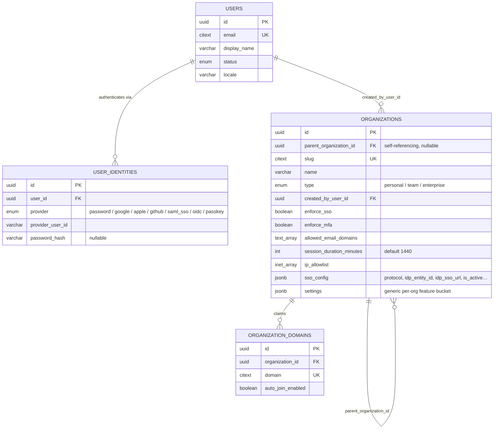
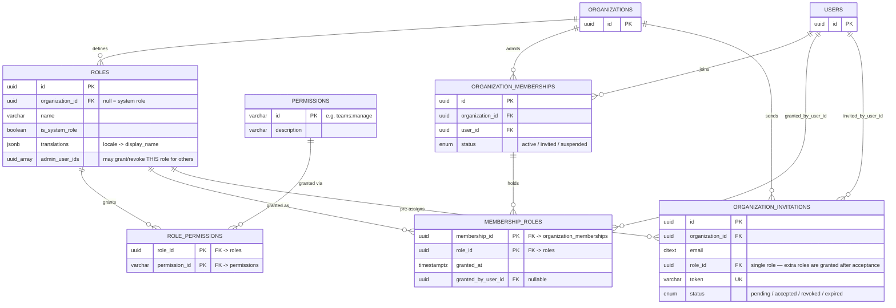
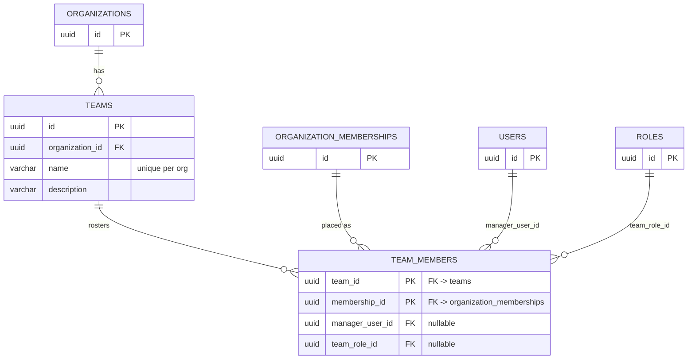
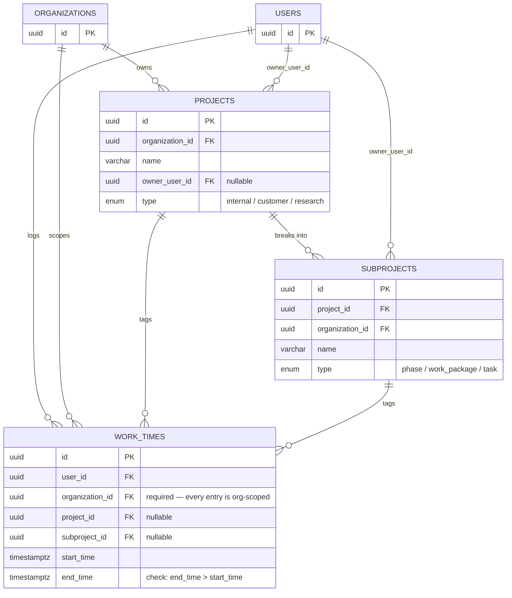
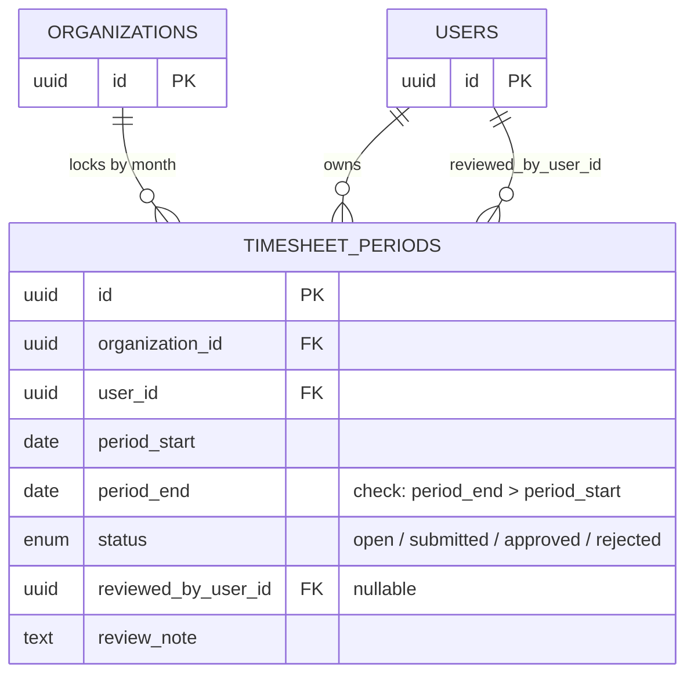
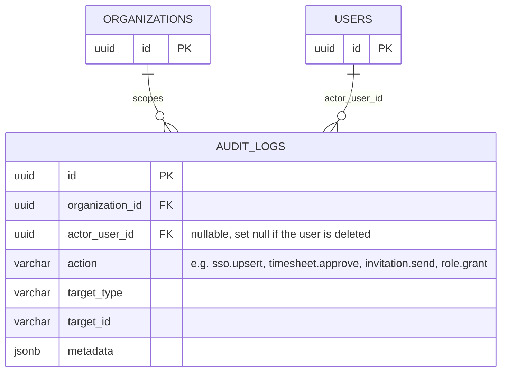

# Worktime Database Schema

Postgres · Liquibase · Drizzle ORM

17 tables across six subsystems, all scoped to a tenant through `organization_id` —
which is `NOT NULL` on `work_times`, since every entry belongs to an organization
whether or not it's tagged to a project. Each section below is a self-contained
entity-relationship diagram for one subsystem; tables that also appear elsewhere
(mainly `organizations` and `users`) are shown with just their primary key for
context — their full column list lives in the section where they're introduced.

**Notation:** `PK` primary key · `FK` foreign key · `UK` unique constraint.
Timestamps (`created_at`/`updated_at`) are omitted from the diagrams for clarity.

## Identity & Organizations (4 tables)

Users, how they authenticate, and the tenant tree they belong to. Security
settings and SSO federation live directly on the organization row, not in side
tables.

> Folded in from two 1:1 tables that used to sit beside `organizations` —
> `organization_settings` (flattened into real columns) and
> `sso_configurations` (kept as the `sso_config` JSON blob, same field names).

## Access Control / RBAC (6 tables)

Roles can be system-wide (`organization_id` null) or scoped to one org. A
membership now holds **any number** of roles at once, through
`membership_roles` — permissions are additive across them.

> One membership row per `(organization_id, user_id)` — `uq_org_user_membership`
> — but any number of rows in `membership_roles` for it. Granting or revoking a
> role requires being an org owner/admin, or being listed in that role's own
> `admin_user_ids`.

## Teams (2 tables)

A team rosters existing org memberships, not users directly — a manager and a
team-specific role can be layered on each seat.

## Projects & Time Tracking (3 tables)

Work entries tag an optional project/subproject; both fall back to null on
delete rather than orphan the entry.

## Timesheets (1 table)

Month-end lock/approve state for a person's booked hours.

> One period per `(organization_id, user_id, period_start)` —
> `uq_timesheet_period`. Work-time writes are rejected once the covering
> period is `submitted` or `approved`.

## Audit (1 table + 1 view)

Every administrative action (invites, timesheet review, SSO/domain config,
role grants) writes one row here.

> `audit` is a read-only view over `audit_logs` exposing the same rows under
> legacy column names (`uuid`, `entity`, `actionby`) — not a separate table.

## Enumerated Types (8 enums)

| Enum | Values |
|---|---|
| `user_status` | `active`, `suspended`, `deactivated` |
| `auth_provider_type` | `password`, `google`, `apple`, `github`, `saml_sso`, `oidc`, `passkey` |
| `organization_type` | `personal`, `team`, `enterprise` |
| `membership_status` | `active`, `invited`, `suspended` |
| `invitation_status` | `pending`, `accepted`, `revoked`, `expired` |
| `project_type` | `internal`, `customer`, `research` |
| `subproject_type` | `phase`, `work_package`, `task` |
| `timesheet_status` | `open`, `submitted`, `approved`, `rejected` |

## Not diagrammed

- `static_data` — a standalone, non-tenant-scoped table of admin-managed
  enum/dropdown values (no foreign keys).
- Liquibase's own bookkeeping tables `databasechangelog` /
  `databasechangeloglock`.

---

Generated from `apps/api/src/db/schema.ts` (Drizzle ORM, introspected from the
Liquibase-managed schema) on 2026-09-11. A styled, interactive version of this
reference is also published as a Claude artifact.
