# Worktime Database Schema

Postgres · Liquibase · Drizzle ORM

30 tables across twelve subsystems, all scoped to a tenant through `organization_id` —
which is `NOT NULL` on `project_times`, since every entry belongs to an organization
whether or not it's tagged to a project. Each section below is a self-contained
entity-relationship diagram for one subsystem; tables that also appear elsewhere
(mainly `organizations` and `users`) are shown with just their primary key for
context — their full column list lives in the section where they're introduced.

**Notation:** `PK` primary key · `FK` foreign key · `UK` unique constraint.
Timestamps (`created_at`/`updated_at`) are omitted from the diagrams for clarity.

## Identity & Organizations (4 tables)

Users, how they authenticate, and the tenant tree they belong to. Security
settings and SSO federation live directly on the organization row, not in side
tables.

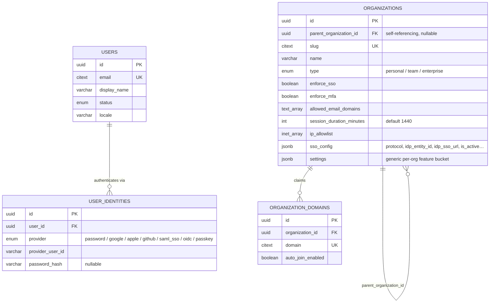

> Folded in from two 1:1 tables that used to sit beside `organizations` —
> `organization_settings` (flattened into real columns) and
> `sso_configurations` (kept as the `sso_config` JSON blob, same field names).

## Access Control / RBAC (5 tables)

Roles can be system-wide (`organization_id` null) or scoped to one org. A
membership holds **any number** of roles at once, as a `role_ids` uuid
array on `organization_memberships` — permissions are additive across them.

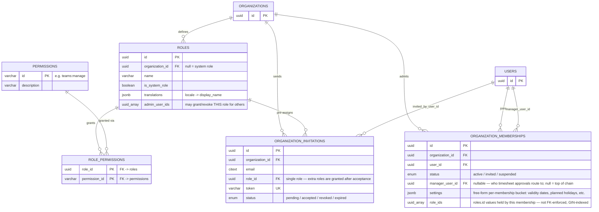

> One membership row per `(organization_id, user_id)` — `uq_org_user_membership`
> — but any number of entries in its `role_ids` array. A membership must always
> keep at least one. Granting or revoking a role requires being an org owner/admin, or being listed in that role's own
> `admin_user_ids`. A member's `manager_user_id` is who their timesheet
> submissions route to for approval (see Timesheets below) — an org admin can
> always review/approve regardless of this chain.

## Teams (2 tables)

A team rosters existing org memberships, not users directly. Each team has one
designated lead (an org admin's call, not the members' own) who — along with
org admins — is the only one allowed to onboard/offboard members on that team;
a team-specific role can additionally be layered on each seat.

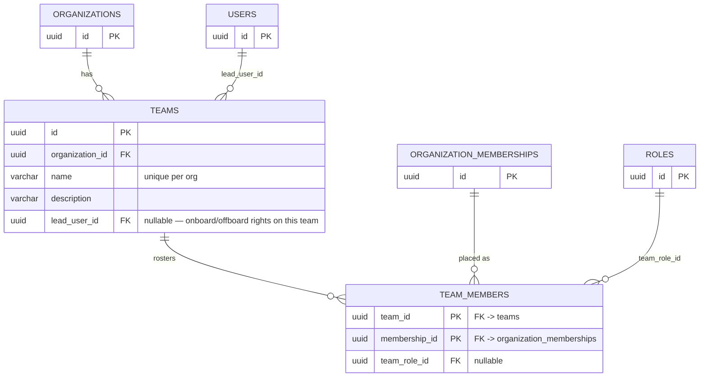

## Projects & Time Tracking (3 tables)

Work entries tag an optional project/subproject; both fall back to null on
delete rather than orphan the entry.

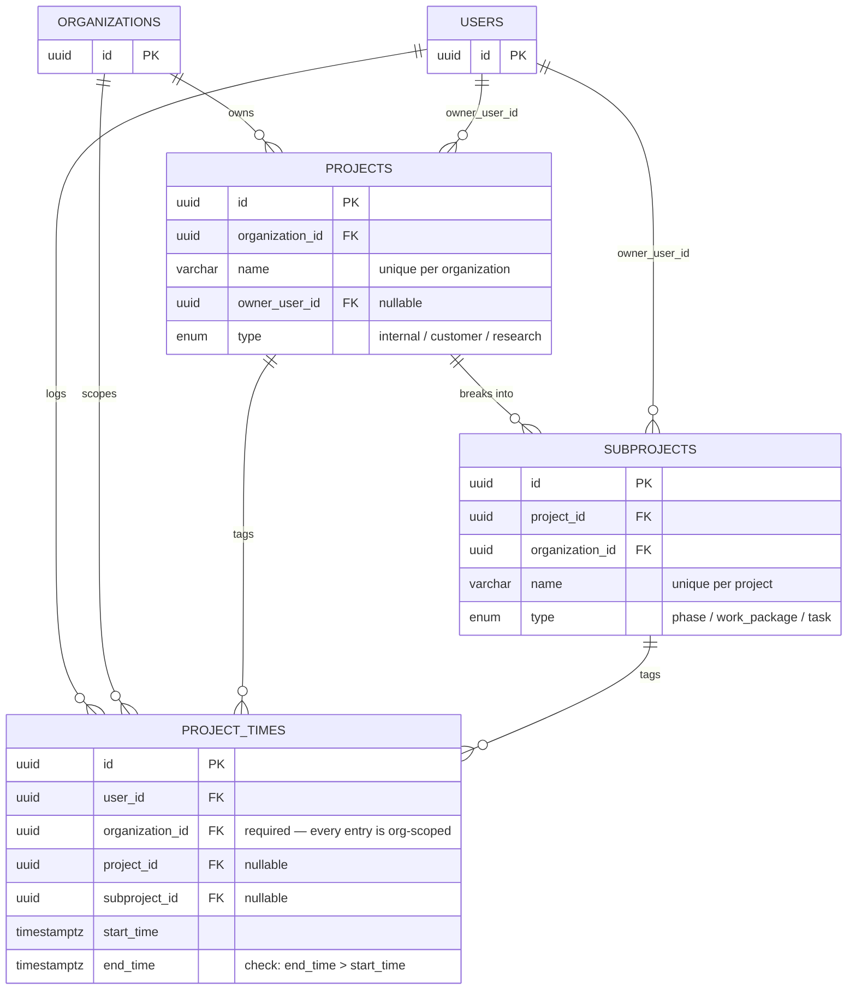

## Timesheets (1 table)

Month-end lock/approve state for a person's booked hours.

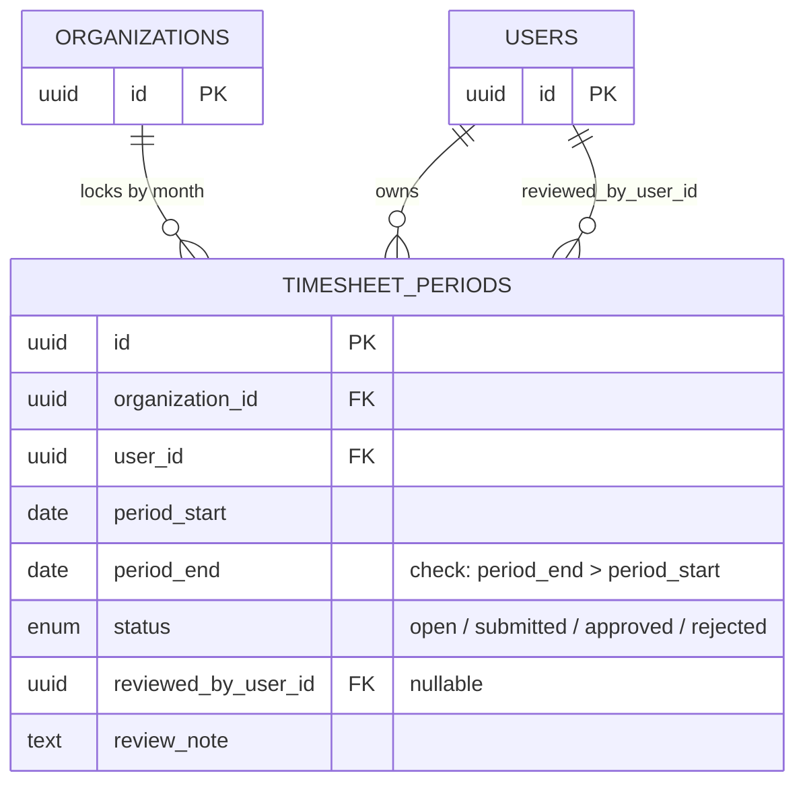

> One period per `(organization_id, user_id, period_start)` —
> `uq_timesheet_period`. Work-time writes are rejected once the covering
> period is `submitted` or `approved`.

## Attendance & Balances (4 tables)

`work_times` is the attendance clock (check-in/check-out stamps) — distinct
from `project_times`, which tags hours against a project/activity rather
than recording whether someone was at work at all. Approving a timesheet
period compares `work_times` sessions in that period against the person's
contracted hours and posts one row to `work_time_balance_entries`, an
append-only ledger; `work_time_balances` is the fast-read running total
maintained alongside it. `absences` (vacation requests, but also sickness,
military service, etc. — see `absence_type`) feed the same ledger, but only
when `absence_type = 'vacation'`: the debit is `workingDays × dayHours`
(halved when `half_day`), where `dayHours` is the org's
`settings.maxHoursPerDay` (`organizations.settings`, see Identity &
Organizations above) — a flat org-wide figure, not the requester's own
contracted hours.
Other absence types are tracked (and optionally evidenced — see the
Documents section) but don't move the balance.

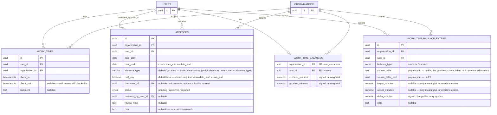

> One open session per person at a time, globally — enforced by
> `uq_work_times_one_open_session`, a unique index on `user_id` where
> `check_out IS NULL`. `work_time_balances` is a cache: every write to it
> happens transactionally alongside the ledger row in
> `work_time_balance_entries` that justifies it (a timesheet approval, an
> approved vacation, or an admin's manual adjustment) — reopening an
> approved timesheet period posts an offsetting entry rather than mutating
> history. Contracted hours (`weeklyTargetMinutes`, defaulting to a 40h
> week) live in `organization_memberships.settings`, the same free-form
> bucket documented in Access Control / RBAC above.

## Documents (1 table)

Generic uploaded-file metadata (a doctor's note for an absence, a pay slip
for an expense) — one table reused by any record that needs at most one
evidence attachment, rather than a bespoke table per attachment kind. The
owning record (`absences`, `expenses`) holds the relationship, via its own
nullable `document_id` FK into this table; access control is always
checked through that owning row (its own owner/manager/admin rules), never
through `documents` directly. The file itself lives on local disk under
the API server (path controlled by `DOCUMENTS_DIR`), keyed by
`storage_path`.

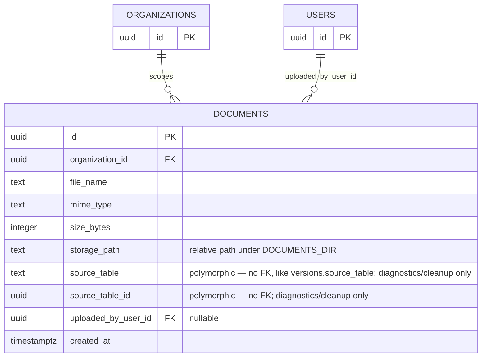

> `source_table`/`source_table_id` are a reverse pointer to whatever row
> this was uploaded for (e.g. `('absences', <absence id>)`) — useful for
> "every document ever attached to record X" queries, but not what access
> control or the UI's "does this record have a document" check goes
> through; that's always the owning row's own `document_id` FK (a record
> can only ever have the *one* document that FK currently points to).
> Uploading a replacement deletes the previous `documents` row and file
> rather than keeping history.

## Expenses (3 tables)

Employees log ad hoc expense line items and bundle a self-chosen subset into
an expense report for approval — unlike `timesheet_periods` (an implicit
date-range envelope), a report here is explicit, so `expense_report_items`
links specific expenses to specific reports.

```mermaid
erDiagram
    ORGANIZATIONS ||--o{ EXPENSES : "scopes"
    USERS ||--o{ EXPENSES : "logs"
    PROJECTS ||--o{ EXPENSES : "tags"
    SUBPROJECTS ||--o{ EXPENSES : "tags"
    ORGANIZATIONS ||--o{ EXPENSE_REPORTS : "scopes"
    USERS ||--o{ EXPENSE_REPORTS : "owns"
    USERS ||--o{ EXPENSE_REPORTS : "reviewed_by_user_id"
    EXPENSE_REPORTS ||--o{ EXPENSE_REPORT_ITEMS : "bundles"
    EXPENSES ||--o| EXPENSE_REPORT_ITEMS : "included as"
    ORGANIZATIONS ||--o{ EXPENSE_REPORT_ITEMS : "scopes"

    EXPENSES {
        uuid id PK
        uuid user_id FK
        uuid organization_id FK
        uuid project_id FK "nullable"
        uuid subproject_id FK "nullable"
        date expense_date
        varchar category "static_data-backed picklist"
        varchar sub_category "nullable, static_data-backed picklist"
        varchar billing_type "nullable, static_data-backed picklist"
        numeric original_value "nullable, must be > 0"
        char original_currency "nullable, ISO 4217"
        char currency "ISO 4217"
        numeric quantity "nullable, must be >= 0"
        text comment "nullable"
        numeric value "default 0 — org-currency amount, hand-entered"
        uuid document_id FK "nullable -> documents; e.g. a pay slip"
    }
    EXPENSE_REPORTS {
        uuid id PK
        uuid organization_id FK
        uuid user_id FK
        text status "in_preparation / submitted / approved / rejected / submitted_processing / processing_finished / request_payment / finished — CHECK constraint, not a DB enum"
        timestamptz date_submitted "nullable"
        uuid reviewed_by_user_id FK "nullable"
        text review_note "nullable"
        jsonb data
    }
    EXPENSE_REPORT_ITEMS {
        uuid id PK
        uuid expense_report_id FK
        uuid expense_id FK UK "one report per expense"
        uuid organization_id FK
    }
    ORGANIZATIONS { uuid id PK }
    USERS { uuid id PK }
    PROJECTS { uuid id PK }
    SUBPROJECTS { uuid id PK }
```

> `original_value`/`original_currency` capture exactly what the receipt says
> and are both optional; `value` is the hand-entered amount in the org's
> reporting currency (`currency`), defaulting to 0 until filled in.
> `category`/`sub_category`/`billing_type` are free-text picklists backed by
> `static_data`, not DB enums or FKs — same pattern as `project_times`.

## Workflows & Notifications (3 tables)

Generic, definition-driven approval/request workflows (e.g. "reopen my
approved month") that can be assigned to one or more users or to a whole
team, plus the per-recipient notification rows they — and other events —
generate.

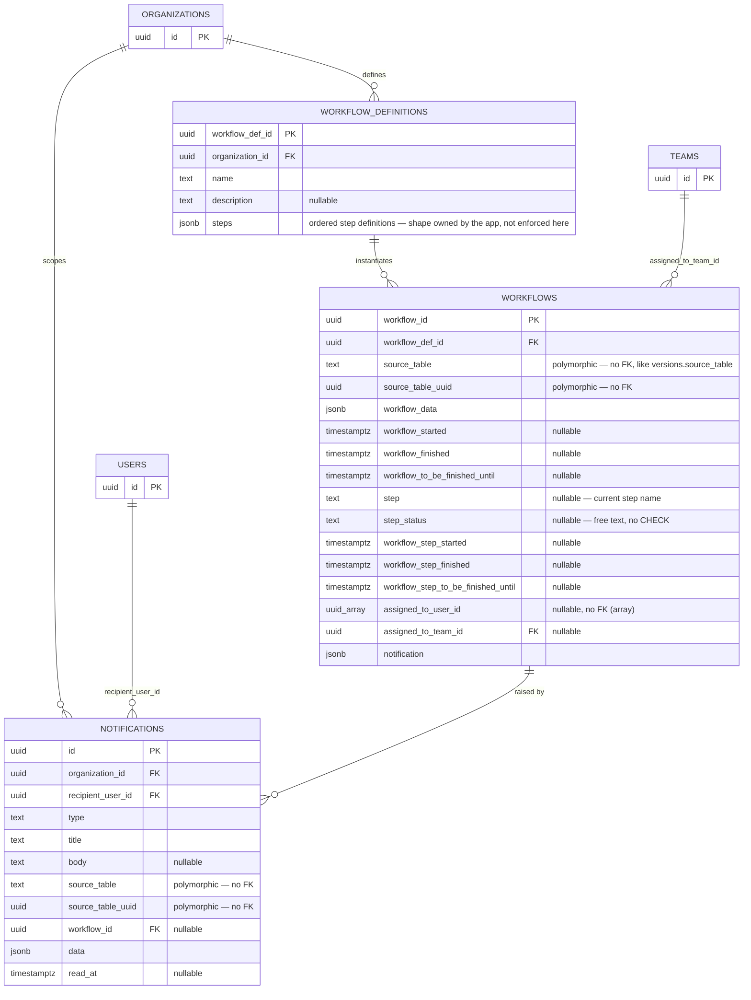

> `chk_workflows_assignee_required`: a workflow must have `assigned_to_user_id`
> and/or `assigned_to_team_id` set. Notifications get one row per
> `(recipient, event)` rather than a single JSON blob on `workflows` — a
> team-assigned step must notify every member independently, each with their
> own read state. `NotificationsGateway` (WebSocket) only pushes a live copy
> of a row that already exists here, so a missed push is never a lost
> notification, only a delayed one.

## Versioning (1 table)

Generic per-record version history: one row per tracked
`(source_table, source_table_uuid)` entity, holding the current version
number plus a full history of past actions.

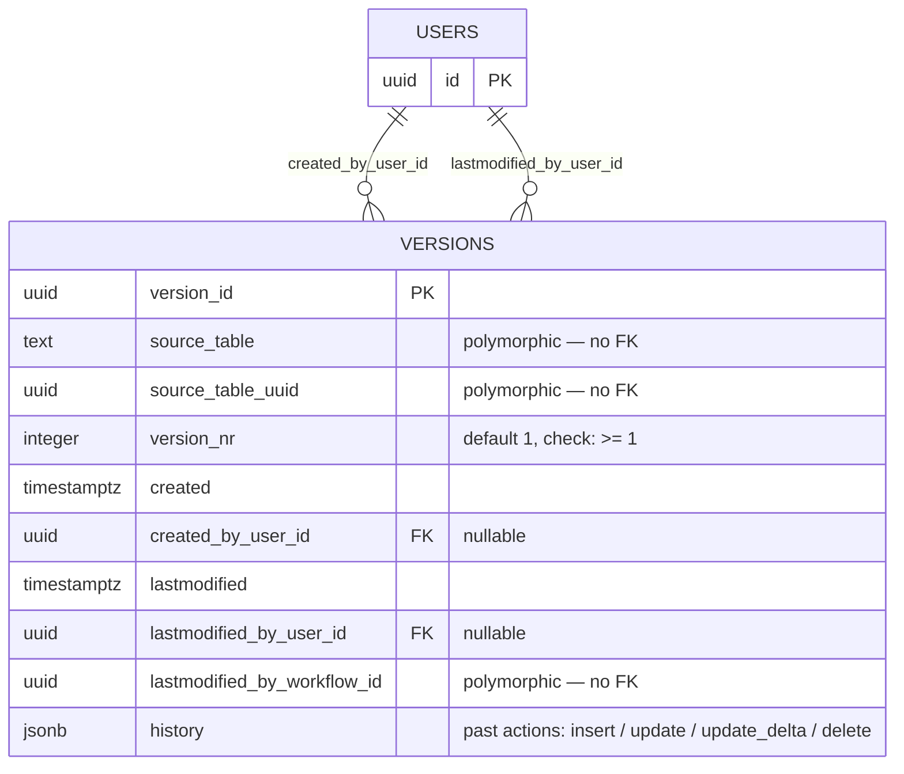

> `uq_versions_source_table_record`: one row per `(source_table,
> source_table_uuid)`. `source_table_uuid` and `lastmodified_by_workflow_id`
> are deliberately plain UUID columns with no FK — this table is polymorphic
> across every other table in the schema, so referential integrity for
> "which record" can't be enforced at the DB level here.

## Audit (1 table + 1 view)

Every administrative action (invites, timesheet review, SSO/domain config,
role grants) writes one row here.

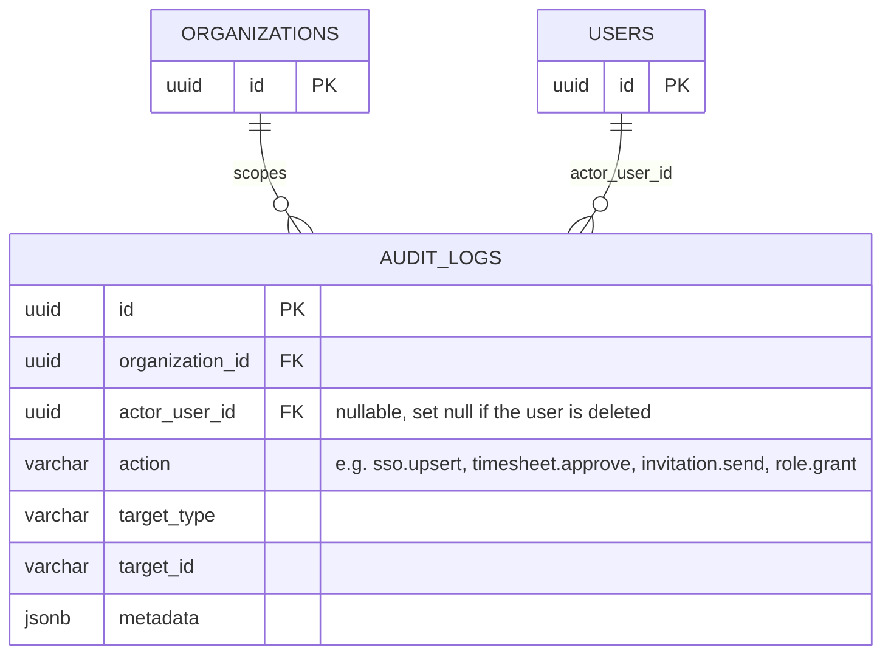

> `audit` is a read-only view over `audit_logs` exposing the same rows under
> legacy column names (`uuid`, `entity`, `actionby`) — not a separate table.

## Static Data (1 table)

Admin-managed dropdown/enum values (e.g. a project type list), scoped per
organization so different orgs can define their own — not a platform-wide
catalog.

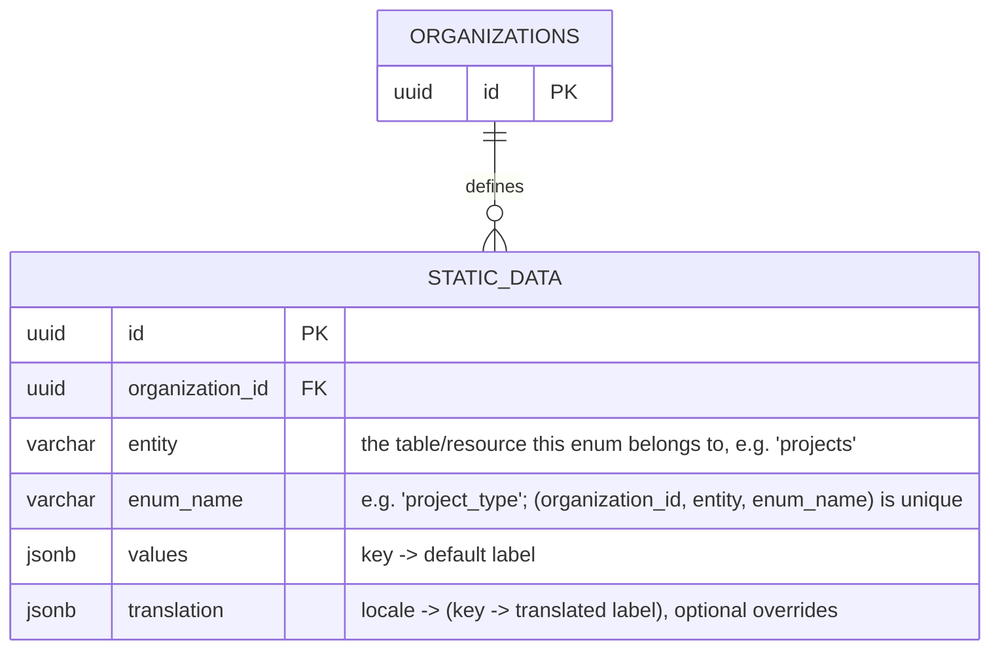

> One row per `(organization_id, entity, enum_name)` — `uq_static_data_org_entity_enum`.
> Managing it (create/edit/delete) requires being that organization's admin;
> any member can read it. Nothing references `static_data.id` by foreign key —
> consumers (e.g. `absences.absence_type`, entity `"absences"`/enum_name
> `"absence_type"`) match against its `values` keys at the application layer
> instead, falling back to a built-in default set if an org has no override row.

## Enumerated Types (10 enums)

| Enum | Values |
|---|---|
| `user_status` | `active`, `suspended`, `deactivated` |
| `auth_provider_type` | `password`, `google`, `apple`, `github`, `saml_sso`, `oidc`, `passkey` |
| `organization_type` | `personal`, `team`, `enterprise` |
| `membership_status` | `active`, `invited`, `suspended` |
| `invitation_status` | `pending`, `accepted`, `revoked`, `expired` |
| `project_type` | `internal`, `customer`, `research` |
| `subproject_type` | `phase`, `work_package`, `task` |
| `timesheet_status` | `open`, `submitted`, `approved`, `rejected` |
| `absence_status` | `pending`, `approved`, `rejected` |
| `balance_entry_type` | `overtime`, `vacation` |

`expense_reports.status` and `workflows.step`/`step_status` are plain `text`
columns, not DB enums — the former is CHECK-constrained (see Expenses above),
the latter is free-form.

## Not diagrammed

- Liquibase's own bookkeeping tables `databasechangelog` /
  `databasechangeloglock`.

---

Generated from `apps/api/src/db/schema.ts` (Drizzle ORM, introspected from the
Liquibase-managed schema) on 2026-09-18. A styled, interactive version of this
reference is also published as a Claude artifact.
